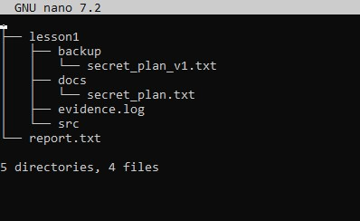
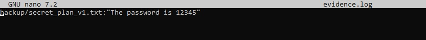
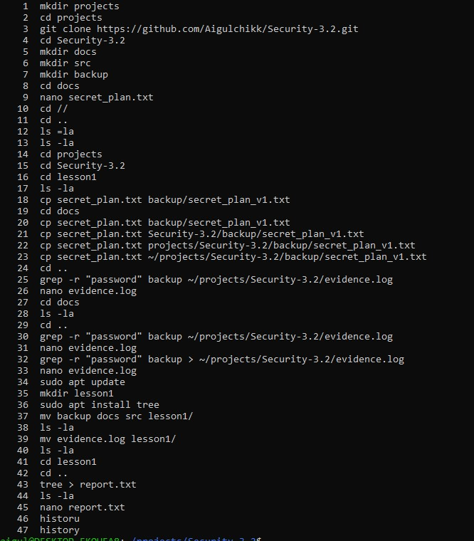

# HW Security №4

## 1. Скриншот терминала, где виден результат команды tree ~/secure_project

## 2.Копию содержимого файла evidence.log.

## 3.Список команд, которые вы вводили для выполнения задания (вывод history).

