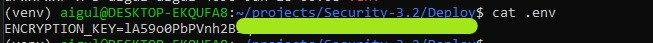

## 1. Скриншот локального файла .env (замажьте часть ключа).

## 2. Скриншот терминала сервера, где вы делаете cat storage/... и видите зашифрованный текст.
.jpg "encrypted text")

## 3. Скриншот браузера/Postman, где вы скачали этот же файл через API и видите читаемый текст.
.jpg "text")

## 3 (2). Скриншот успешного скачивания файла (в браузере видно оригинальное имя).
.jpg "download - 2")